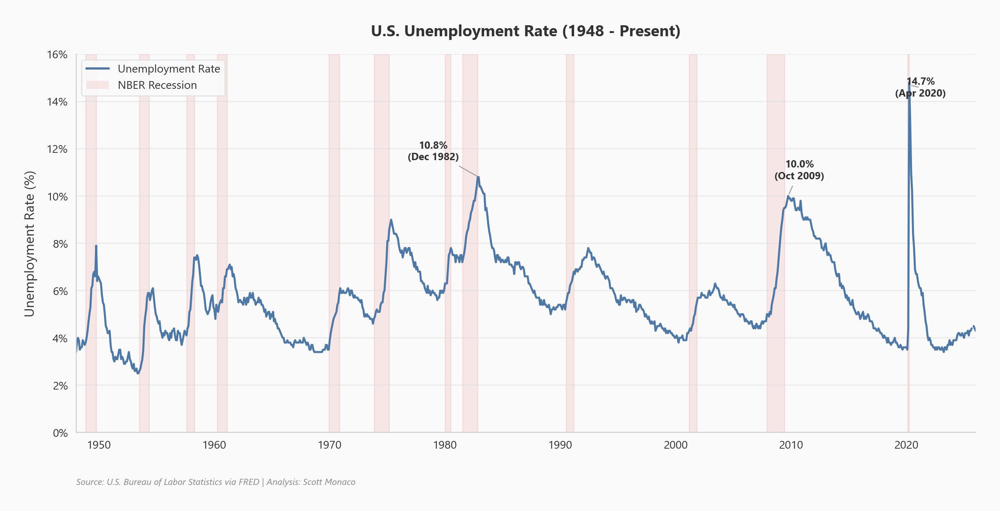
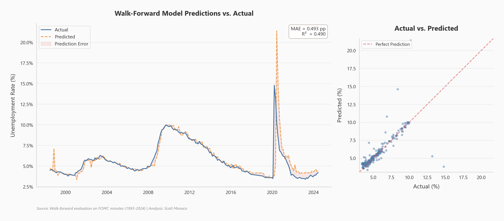

# Predicting Unemployment from FOMC Meeting Minutes

An NLP and machine learning pipeline that predicts the next month's U.S. unemployment rate from the text of Federal Reserve Open Market Committee (FOMC) meeting minutes. Deployed as a multi-page Streamlit web app.



## What This Project Does

Federal Reserve meeting minutes contain forward-looking language about labor market conditions, inflation expectations, and monetary policy. This project extracts 77 quantitative features from that text — including sentiment scores, economic keyword frequencies, latent topics, and TF-IDF components — then combines them with lagged unemployment values to predict what unemployment will be next month.

Eight candidate models were evaluated using time-series cross-validation (no future data leakage). The best performer was **Lasso regression** (alpha=0.01), which achieved:

| Metric | Value |
|--------|-------|
| **Test MAE** | 0.608 percentage points |
| **Test R-squared** | 0.496 |
| **Test MAPE** | 7.2% |
| **Training period** | 1993 - 2024 (229 FOMC meetings) |



### Key Findings

- Lagged unemployment values are the strongest predictors, which is expected given the autocorrelated nature of the series.
- Text-derived features (TF-IDF/SVD components, economic keywords, sentiment) provide incremental improvement over a lag-only baseline.
- Regularized linear models (Lasso, Ridge) outperformed tree ensembles (XGBoost, Gradient Boosting) on this small dataset, likely because regularization handles the high feature-to-sample ratio better.
- The model struggles most during regime shifts (e.g., the COVID-19 spike in 2020), where historical patterns break down.

### Model Comparison

| Model | CV MAE |
|-------|--------|
| Lasso | 0.600 |
| Ensemble (Top 3) | 0.636 |
| XGBoost | 0.676 |
| Gradient Boosting | 0.679 |
| Random Forest | 0.695 |
| Ridge | 0.699 |
| Elastic Net | 0.980 |
| Linear Regression | 1.574 |

## Live App

Try the interactive prediction tool: [Streamlit App](https://fed-minutes-unemployment-prediction-mflpwgbf5udx2lfcoewvgo.streamlit.app/)

---

## Replication Guide

### Prerequisites

- Python 3.10+
- Git

### 1. Clone and install dependencies

```bash
git clone https://github.com/YOUR_USERNAME/fed-minutes-unemployment-prediction.git
cd fed-minutes-unemployment-prediction
pip install -r requirements.txt
```

### 2. Scrape the FOMC minutes data

The raw data CSV is not included in the repo (46MB). Run the scraper to download all FOMC meeting minutes from the Federal Reserve website:

```bash
python policy_minutes_scrape.py
```

This creates `data/scraped_data_all_years_true.csv` (~243 meetings, 1993-present). Requires internet access and takes a few minutes.

### 3. Train the model

This generates all model artifacts in the `models/` directory. Requires internet access to fetch unemployment data from FRED.

```bash
python train.py
```

Expected output:

```
Step 1: Loading data...
  Loaded 235 meetings from 1993-02-03 to 2024-06-12
Step 2: Splitting data...
Step 3: Engineering features...
Step 4: Running model selection...
  ...
Step 9: Saving artifacts...
Done! All artifacts saved to: models
```

Training takes approximately 2-5 minutes depending on your hardware.

### 4. Run the Streamlit app locally

```bash
streamlit run app.py
```

Open http://localhost:8501 in your browser. You should see the landing page with metric cards and an unemployment rate chart.

### Project Structure

```
fed-minutes-unemployment-prediction/
  app.py                          # Streamlit landing page
  train.py                        # Run this to retrain the model
  pages/
    1_Prediction_Tool.py          # Make predictions from FOMC text
    2_Model_Performance.py        # Metrics, charts, validation results
    3_Data_Explorer.py            # Browse FOMC data, sentiment trends
    4_About.py                    # Methodology and info
  src/
    config.py                     # Constants, keyword lists, hyperparameters
    text_preprocessor.py          # Text cleaning
    data_loader.py                # Load CSV + FRED, merge, clean
    feature_engineering.py        # FOMCFeatureEngineer class (fit/transform)
    model_training.py             # Candidate models, grid search, ensemble
    validation.py                 # TimeSeriesSplit CV, metrics
    confidence_intervals.py       # Bootstrap prediction intervals
    pipeline.py                   # Orchestrates full training pipeline
    visualizations.py             # Shared Plotly chart builders
  models/                         # Saved artifacts (generated by train.py)
  data/
    scraped_data_all_years_true.csv   # Scraped FOMC minutes (1993-2024)
  policy_minutes_scrape.py        # Data collection utility
  .streamlit/config.toml          # Theme configuration
  requirements.txt
```

---

## Maintenance Guide: Keeping the Model Fresh

The model was last trained on FOMC minutes through **June 2024**. As new meetings occur and new unemployment data is released, the model will become stale. Here's how and when to refresh it.

### When to Retrain

| Trigger | Frequency | Why |
|---------|-----------|-----|
| **Routine refresh** | Every 6 months | Incorporates ~4 new FOMC meetings and keeps lag features current |
| **After a regime shift** | As needed | If unemployment moves sharply (>1pp in a few months), retrain immediately — the model's lag features need recent data to stay calibrated |
| **Annual full refresh** | Once per year | Re-scrape all minutes, re-run the full pipeline, review model selection results to confirm Lasso is still the best choice |

**Bottom line**: retrain at least every 6 months. More often doesn't help much since FOMC only meets ~8 times per year.

### Step-by-Step Refresh Process

#### Step 1: Scrape new FOMC minutes

Run the scraper to update the CSV with any new meetings published since the last scrape:

```bash
python policy_minutes_scrape.py
```

This overwrites `data/scraped_data_all_years_true.csv` with all available minutes from the Fed website. Verify the row count increased:

```bash
python -c "import pandas as pd; print(len(pd.read_csv('data/scraped_data_all_years_true.csv')), 'meetings')"
```

#### Step 2: Retrain the model

```bash
python train.py
```

This will:
- Load the updated CSV
- Fetch the latest unemployment data from FRED automatically
- Re-engineer all 77 features
- Re-run model selection (GridSearchCV across 8 models)
- Retrain the winner on all data
- Regenerate all artifacts in `models/`

#### Step 3: Review the results

Check the training report for any degradation:

```bash
python -c "
import json
with open('models/training_report.json') as f:
    r = json.load(f)
print(f'Best model: {r[\"best_model\"]}')
print(f'Test MAE:   {r[\"test_metrics\"][\"mae\"]:.3f}pp')
print(f'Test R2:    {r[\"test_metrics\"][\"r2\"]:.3f}')
print(f'Samples:    {r[\"n_training_samples\"]}')
"
```

Things to watch for:
- **MAE increasing significantly** (>0.8pp) could mean the feature engineering needs updating or there's a structural break in the data.
- **A different model winning** is normal and fine — the pipeline automatically selects the best one.
- **Sample count** should increase by ~8 per year (one per FOMC meeting).

#### Step 4: Test the app locally

```bash
streamlit run app.py
```

Verify the landing page metrics reflect the new training run and the Prediction Tool works with current FRED data.

#### Step 5: Deploy

Commit the updated artifacts and push:

```bash
git add models/ data/scraped_data_all_years_true.csv
git commit -m "Retrain model with FOMC minutes through [MONTH YEAR]"
git push
```

If deployed on Streamlit Cloud, it will auto-redeploy from the push.

### What Could Go Wrong

| Issue | Symptom | Fix |
|-------|---------|-----|
| FRED endpoint changes | `train.py` fails at Step 1 | Update the CSV URL in `src/data_loader.py` |
| Fed website restructures | Scraper misses new minutes | Update `policy_minutes_scrape.py` to match new HTML structure |
| Model accuracy degrades over time | Test MAE climbs above 1.0pp | Consider adding new feature categories, increasing TF-IDF vocabulary, or trying different model families |
| New Python/sklearn version breaks joblib files | App crashes on load | Delete `models/` and retrain: `python train.py` |

### Optional Improvements for Future Refreshes

- **Add VADER sentiment**: Was removed for training speed, but can be re-added in `src/feature_engineering.py` for richer sentiment features (expect ~15 min longer training time).
- **Expand keyword dictionaries**: Edit `src/config.py` `KEYWORD_CATEGORIES` to add new economic terms that become relevant (e.g., "AI", "tariffs", "supply chain").
- **Increase bootstrap iterations**: Bump `BOOTSTRAP_N_ITERATIONS` in `src/config.py` from 50 to 200 for tighter confidence intervals (slower training).
